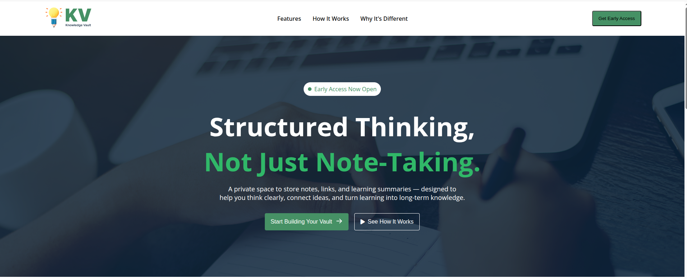
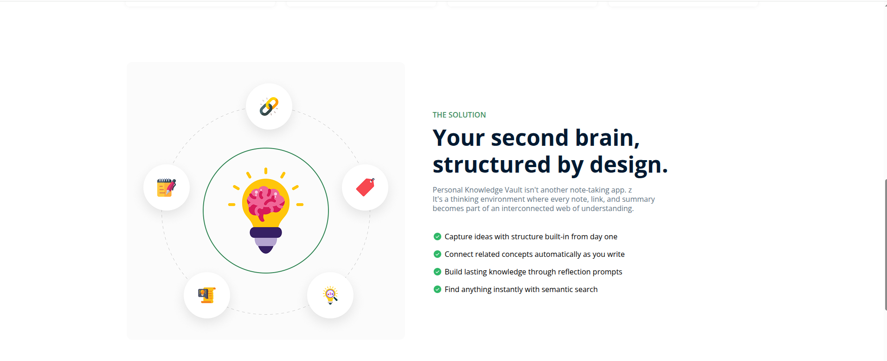
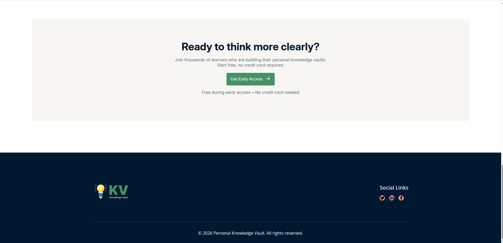

# 🧠 Knowledge Vault

A **personal knowledge management platform** that helps you **organize notes, links, and learning summaries** in a structured, interconnected way.

---

## 🌐 Live Demo

👉 [🔗 Visit Live Website](https://kouser-ahamed.github.io/B13-A01-Knowledge-Vault_Kouser-Ahamed/)

---

## 📸 Project Demo

  
  


---

## 🛠️ Technologies Used

- ⚡ **HTML5** – Semantic markup for structured content  
- 🎨 **CSS3** – Styling, responsive layouts, and hover effects  
- 🧩 **Flexbox & Grid** – Flexible and responsive design  
- 🔤 **Google Fonts – Inter & Open Sans** – Clean typography  
- 🎵 **Font Awesome Icons** – For social & action icons  

---

## ✨ Key Features

- 📝 **Structured note-taking** for clear thinking  
- 🔗 **Link and idea connections** between notes  
- 📊 **Dashboard overview** for all notes at a glance  
- 🎯 **Focus on long-term knowledge retention**  
- 🔍 **Semantic search** for fast retrieval  

---

## 📂 Project Structure

```

KnowledgeVault/
├── assets/
│   └── ProjectDemoSs/
│       ├── img-1.png
│       ├── img-2.png
│       └── img-3.png
├── styles/
│   └── styles.css
├── index.html
└── README.md

````

> Maintain folder structure for proper asset linking.

---

## 💻 Local Setup

1. **Clone the repo:**

```bash
git clone https://github.com/kouser-ahamed/B13-A01-Knowledge-Vault_Kouser-Ahamed.git
````

2. **Navigate to project folder:**

```bash
cd B13-A01-Knowledge-Vault_Kouser-Ahamed
```

3. **Open in browser:**
   Double-click `index.html` or use **Live Server** in VSCode.

---

## 🎓 Learning Outcomes

* ✅ **Responsive layout** with Flexbox & Grid
* ✅ **Semantic HTML** for clarity and SEO
* ✅ **Hover effects & button interactions**
* ✅ **Portfolio-ready UI design**

---

## 🚀 Future Improvements

* 🌙 **Dark mode toggle**
* 🎵 **Audio/voice notes integration**
* 🛠️ **Backend integration for dynamic storage**
* 🔍 **Advanced search and filter features**
* ✨ **Customizable dashboards for users**

---

## 🔗 Useful Links

* 🌐 **Live Demo:** [https://kouser-ahamed.github.io/B13-A01-Knowledge-Vault_Kouser-Ahamed/](https://kouser-ahamed.github.io/B13-A01-Knowledge-Vault_Kouser-Ahamed/)
* 💻 **GitHub Repo:** [https://github.com/kouser-ahamed/B13-A01-Knowledge-Vault_Kouser-Ahamed](https://github.com/kouser-ahamed/B13-A01-Knowledge-Vault_Kouser-Ahamed)
* 🎨 **Font Awesome CDN:** [https://cdnjs.cloudflare.com/ajax/libs/font-awesome/6.4.0/css/all.min.css](https://cdnjs.cloudflare.com/ajax/libs/font-awesome/6.4.0/css/all.min.css)
* 🔤 **Google Fonts – Inter & Open Sans:** [https://fonts.googleapis.com](https://fonts.googleapis.com)

---
